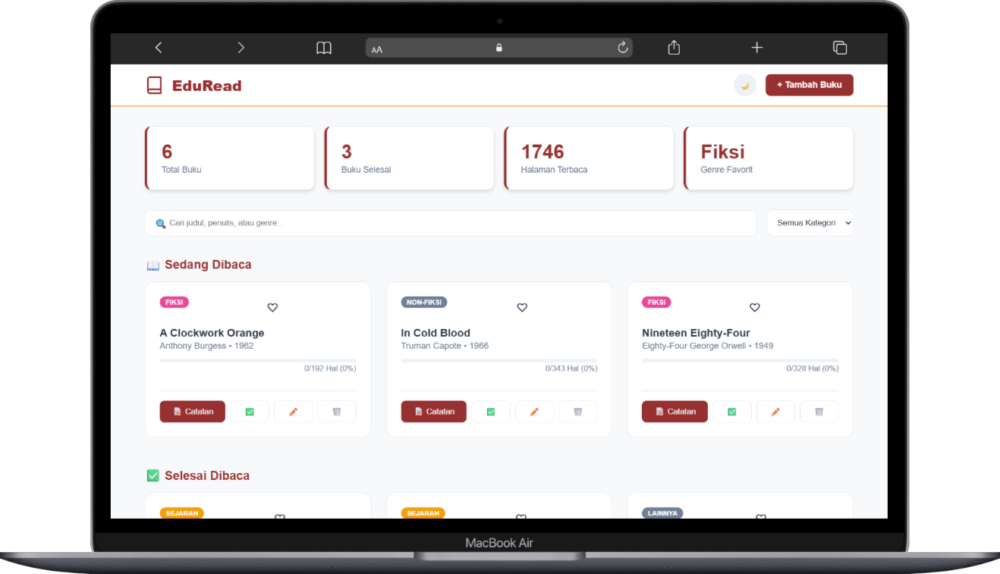
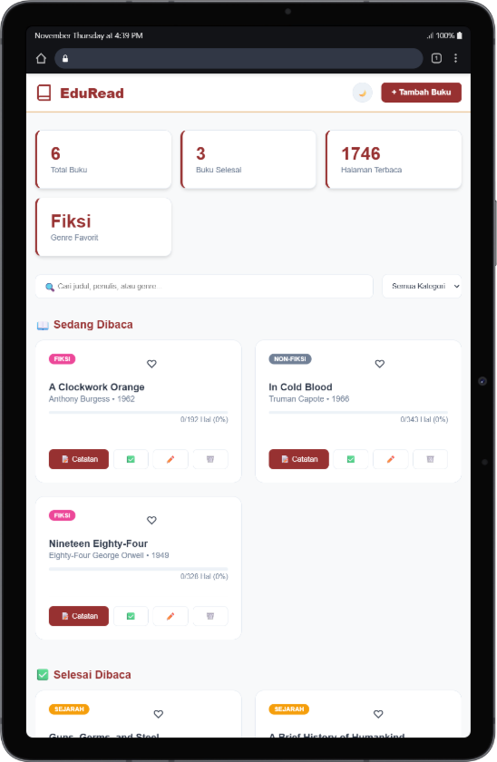
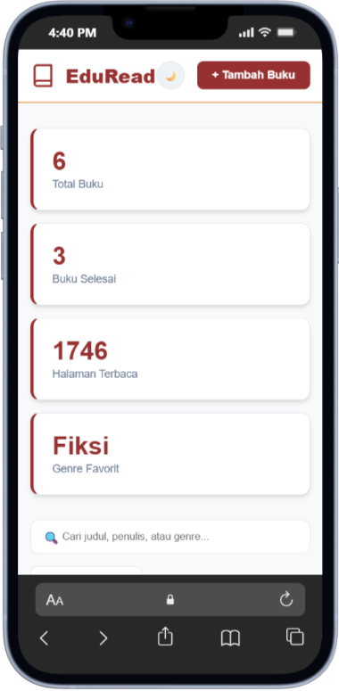

# 📚 EduRead – Smart Library

Aplikasi web modern untuk mengelola perpustakaan pribadi — memungkinkan pengguna melacak buku yang sedang dibaca, mencatat progres, menyimpan kutipan, hingga menganalisis kebiasaan membaca. Dirancang dengan tampilan profesional, responsif, dan mendukung Dark Mode.

---

## 🌐 Live Demo

**🔗 Klik di sini untuk mencoba aplikasi**

> [https://rizaalraihany.github.io/EduRead/](https://rizaalraihany.github.io/EduRead/)

---

## 🚀 Fitur Utama

- 📖 **Manajemen Buku (CRUD)**

  - Tambah, edit, dan hapus buku (dengan modal konfirmasi).
  - Berikan rating 1–5 bintang.
  - Pindahkan buku antar rak (Sedang Dibaca ↔ Selesai Dibaca).

- 📘 **Reading Mode (Mode Fokus)**

  - Input halaman yang sedang dibaca (contoh: 50 dari 300).
  - Simpan catatan membaca & quotes penting.
  - Menampilkan progres membaca secara visual.

- 📊 **Dashboard Statistik & Analitik**

  - Total buku, buku selesai dibaca, total halaman yang sudah dibaca.
  - Analisis kategori/genre yang paling sering dibaca.

- 🌙 **Tema Modern & Responsif**

  - Dark Mode & Light Mode otomatis.
  - Warna elegan: Marun & Emas.
  - Desain clean & minimalis.
  - Optimal di Desktop, Tablet, dan Mobile.

- 🔍 **Pencarian & Filter**

  - Cari buku berdasarkan judul/penulis.
  - Filter berdasarkan kategori/genre.

- 💾 **Penyimpanan Lokal**

  - Semua data tersimpan otomatis di `localStorage`.

---

## 🛠️ Teknologi yang Digunakan

| Teknologi            | Deskripsi                                                |
| -------------------- | -------------------------------------------------------- |
| HTML5                | Struktur semantik halaman aplikasi                       |
| CSS3                 | Styling modern: CSS Variables, Flexbox, Grid, Dark Mode  |
| JavaScript (Vanilla) | Logika utama, DOM manipulation, state management         |
| LocalStorage         | Menyimpan data buku & catatan secara lokal tanpa backend |
| Google Fonts         | Font **Plus Jakarta Sans**                               |
| SVG                  | Ikon dan logo beresolusi tinggi                          |

---

## 📦 Struktur Folder

```
EduRead/
├── index.html              # File utama aplikasi
├── README.md               # Dokumentasi proyek
└── src/
    ├── assets/
    │   └── images/
    │       └── logo.svg    # Logo aplikasi
    ├── js/
    │   └── index.js        # Logika aplikasi
    └── style/
        └── global.css      # Styling utama (CSS)
```

---

## ⚙️ Cara Menjalankan

1. Clone repository:

```bash
git clone https://github.com/RizaAlraihany/EduRead.git
```

2. Masuk ke folder proyek:

```bash
cd EduRead
```

3. Jalankan aplikasi:

- Cukup buka `index.html` di browser, atau
- Gunakan **Live Server** di VSCode untuk pengalaman lebih optimal.

---

## 📸 Tampilan Aplikasi

| Desktop                                    | Tablet                                   | Mobile                                   |
| ------------------------------------------ | ---------------------------------------- | ---------------------------------------- |
|  |  |  |

---

## 👨‍💻 Developer

Dibuat oleh:

- 💙 **Riza Alraihany**

🔗 GitHub: [https://github.com/RizaAlraihany](https://github.com/RizaAlraihany)

🔗 LinkedIn: [https://www.linkedin.com/in/riza-alraihany](https://www.linkedin.com/in/riza-alraihany)

---

## 📄 Lisensi

Proyek ini dilisensikan di bawah **MIT License** — bebas digunakan, dimodifikasi, dan dikembangkan untuk kebutuhan apa pun.

---

> _"Membaca bukan hanya hobi, tapi investasi untuk masa depan."_ 📚✨

---

### Tips Tambahan

- Untuk mengatur **custom domain** di GitHub Pages, buat file `CNAME` di root folder lalu isi dengan domain Anda.
- Simpan aset gambar di folder `src/assets/images/` agar struktur tetap rapi.
